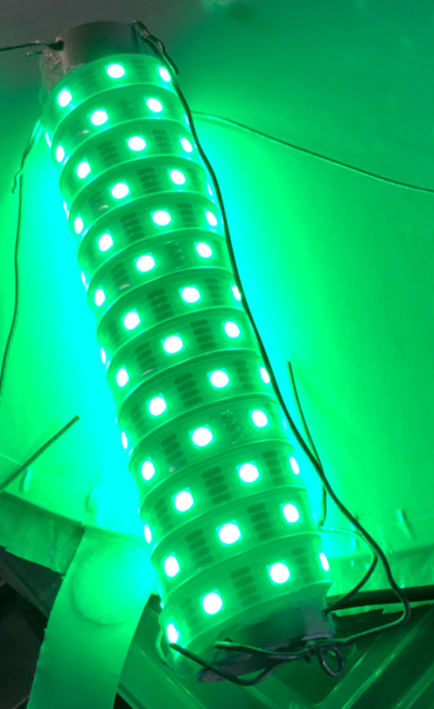
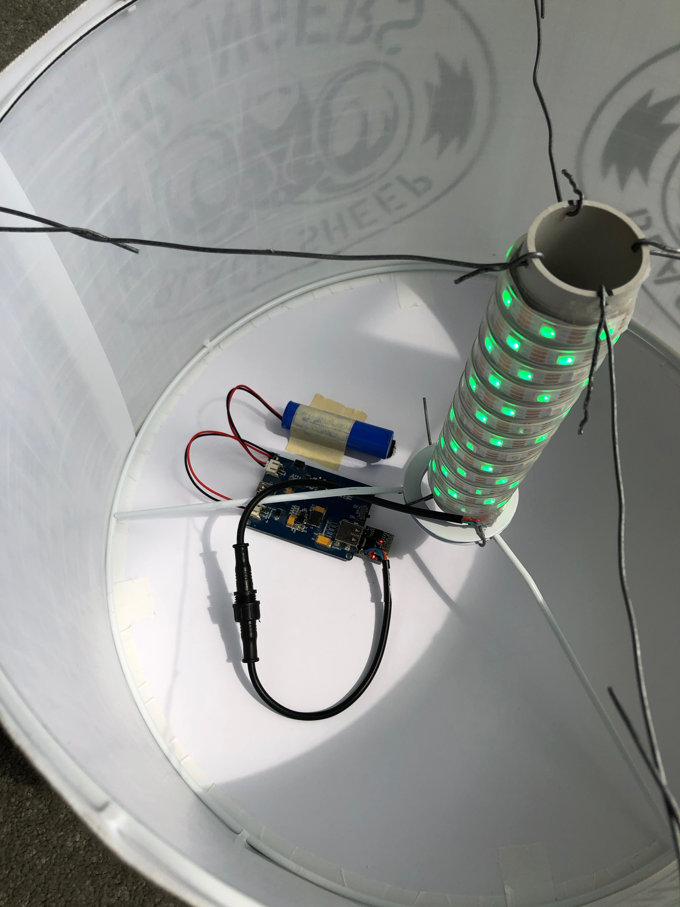

# RangerBeacon_v3
Third-gen Black Sheep Ranger beacon controller.  Now with knobs and buttons!

Designed for use with Cool Neon Gamma-Corrected APA102 strip, and controlled by a SparkFun Pro-Micro 5v/16MHz Arduino clone.

# BSR Light Controller Instructions

## Changing the batteries:
-	**Battery orientation is important!** If the batteries are put in incorrectly the magick smoke will be released and the controller will die.
-	When the batteries are swapped, sometimes the controller needs to be initialized to function.  Plug in a powered micro-USB charging cable until the red lights come on.  After unplugging the USB port use the power button on the side to turn on.  (Charge ports are highlighted in red, and power button is highlighted in green.)
-	When installing fresh batteries always put the spent ones back in the charger so they are ready for the next swap.

## Operation:
- The switch has three positions:
    - Middle:  Off
    - Side 1: Steady green
        -	When in steady green, the knob controls brightness.
    - Side 2: Pulsing
        - When pulsing, the knob controls the speed.
    - The button is the History Eraser Button.  Do not press.
- Charge ports are highlighted in red, and are only used to re-initialize the charge controller.  Charging of batteries should be done in the dedicated charger.
- Power button is highlighted in green.

## Arduino library requirements:
- [APA102](https://github.com/pololu/apa102-arduino)
- [EEPROM](https://github.com/Chris--A/EEPROM)

## Design/Construction notes:

Components:
- [SparkFun Pro Micro 5v/16MHz arduino clone](https://amzn.to/3agCvgn)
- [Double 18650 V8 Lithium Battery Shield](https://amzn.to/3iW2Fsx)
- [18650 Li-Ion Rechargable batteries](https://amzn.to/3pttDdE)
- [Strip of APA102 LEDs](https://amzn.to/39pSTMc)
- [DPDT ON-OFF-ON Toggle switch](https://amzn.to/2YreQEi)
- [10k potentiometer with knob](https://amzn.to/3pv1nqS)
- Lamp shade
- Segment of PVP
- Silicone cement
- Baling wire
- [3D printed controller housing](https://www.tinkercad.com/things/3O1gfHXZOxo-ranger-beacon-box)

Start with a white/translucent lamp shade.  Cut a piece of PVP pipe so that it fits within the height of the lamp shade with a little extra on both ends to drill holes and secure baling wire.  Wrap the pipe in your APA102 LED strip, using silicone cement to secure it in place.

- Connect the 5v and GND pins of the APA strip to the battery shield directly.
- DI on the APA102 strip goes to D16 on the Pro Mini.
- CI on the APA102 strip goes to D15 on the Pro Mini.
- One side of the toggle goes to D2, the other to D3, and the center to GND on the Pro Mini
- One side of the potentiometer goes to GND, the other to VCC, and the center to A0 on the Pro Mini
- If you want it to look nice and clean, you can use the 3D printed controller housing model to create a housing.  

Put it all together with baling wire, like in the picture below.

The logo silhouette is created by printing your graphics on transparency sheets and affixing to the outside of the lampshade.

Copyright 2021 - Chris Knight - merlin@ghostwheel.kiwi

Released under the [CC BY-NC-SA license](https://creativecommons.org/licenses/by-nc-sa/4.0/)
